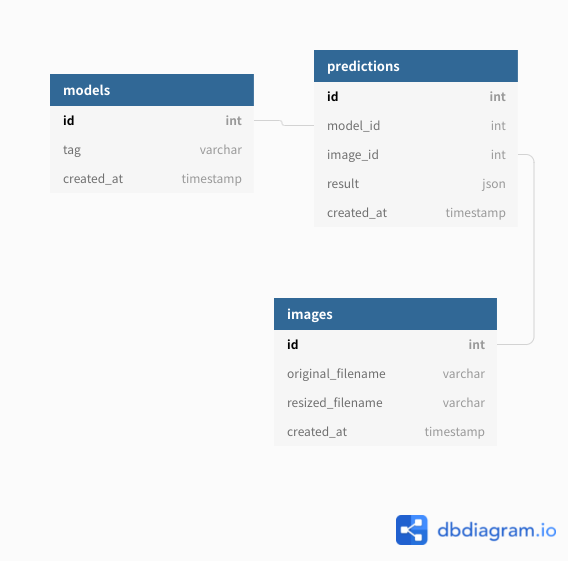

# ER 図・DDL の生成

[dbdiagram.io](https://dbdiagram.io/home) を使用しています。

## ER 図

## DDL の生成

[./docker-entrypoint-initdb.d/init.sql](./docker-entrypoint-initdb.d/1_create_table.sql) は [dbdiagram.io](https://dbdiagram.io/home) を使って [dbdiagram.txt](dbdiagram.txt) から生成しました。

ただし、current_timestamp のみサポートされていないため、手作業で書き換えています。
